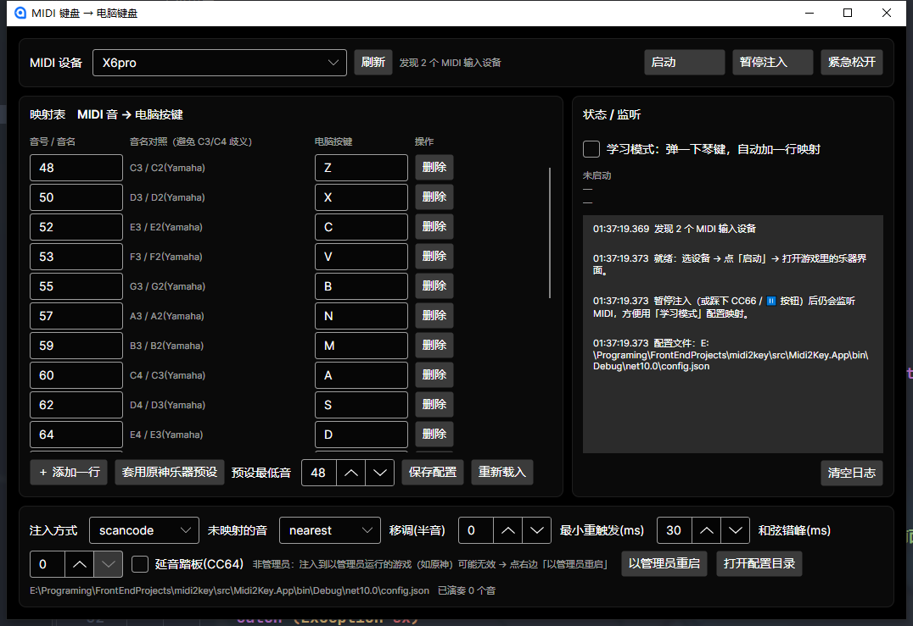

# ToireMidi2Key

**把 MIDI 键盘（电钢 / 数码钢琴 / 合成器）变成电脑键盘：弹哪个音，就等于按下哪个按键。**



## 这个应用是做什么的

**让任何「只认键盘」的程序，都能用 MIDI 键盘来弹。**

程序在后台监听你的 MIDI 键盘，每收到一个音符就立刻向系统注入对应的**真实键盘按键**。
对目标程序来说，你就是在用普通键盘打字——**它完全不需要认识 MIDI。**

```
 MIDI 键盘 ──USB-MIDI──▶ winmm(midiInOpen) ──▶ 映射表 ──▶ SendInput ──▶ 任何程序
                          ① 收音符            ② 查表      ③ 注入真实按键
```

按下 MIDI 键盘的 C3 → 本程序注入按键 `Z` → 目标程序以为你按了 `Z`。

### 为什么做这个

**原神的乐器（风物之诗琴 / 镜花之琴）只认电脑键盘，不认 MIDI 输入**，所以没法用真钢琴键盘弹。
而"只认键盘、不认 MIDI"的程序不止这一个——通用地解决它，就是这个程序的用途。

### 能用来做什么

| 场景 | 说明 |
|---|---|
| **在原神里用真钢琴键盘弹琴** | 内置「套用原神乐器预设」：21 个白键一键生成 → `Z X C V B N M` / `A S D F G H J` / `Q W E R T Y U` 三排键位 |
| **给不支持 MIDI 的软件"打字"** | 任何有输入框的地方都能用琴键输入（把音符映射成字母/空格/回车即可） |
| **把琴键当快捷键用** | 映射成 `F1`~`F12`、`SPACE`、方向键等 |
| **当一个可编程的 MIDI → 键盘转换器** | 命令行 + 图形界面两种用法，映射表可自由编辑并存进配置文件 |

### 特点

- **低延迟**：实测「收到音符 → 按键注入完成」平均 **0.60ms**（p95 1.32ms）；体感延迟基本都来自游戏或音频设备，不是本程序
- **学习模式**：弹一下琴键就自动加一行映射，不用去查 MIDI 音号
- **原神键位预设**：21 个白键一键生成；黑键与超范围音可「就近折叠」到最近的白键
- **图形界面 + 命令行**：GUI 有可视化映射表与实时日志；CLI 适合脚本化与排障
- **自己处理权限**：一键「以管理员重启」（注入到以管理员运行的游戏必须提权），也可设为启动时自动提权
- **纯用户态、只模拟按键**：不读游戏内存、不注入 DLL、不 hook 游戏进程

> ⚠️ 任何第三方工具都可能被游戏判定违规（原神反作弊是内核级 mhyprot）。本工具只做按键模拟，风险最低，但**不为零**，请自行判断。

---

## 快速开始

### 1. 编译

```powershell
# 在项目根目录（含 ToireMidi2Key.sln 的那一层）执行
dotnet build ToireMidi2Key.sln         # VSCode 用 .sln；Rider 用 ToireMidi2Key.slnx
```

### 2. 零风险验证（不碰游戏）

```powershell
$cli = "src\ToireMidi2Key.Cli\bin\Debug\net9.0\ToireMidi2Key.Cli.exe"

& $cli --list        # 有没有识别到你的 MIDI 键盘
& $cli --learn       # ★ 按琴键，看它发的是哪个 MIDI 音号（这一步最关键）
& $cli --selftest    # 离线自检：映射/和弦/黑键折叠/同音重触发，应输出 PASS
& $cli --probe       # SendInput 注入通道是否可用
& $cli --latency     # 实时测本程序内部延迟（详见下文「延迟」）
```

`--learn` 输出示例：

```
音符  MIDI  48   C3 / C2(Yamaha)   力度 100   通道 1   → Z
       写进 config.json："48": "Z"
```

> **为什么要看这个**：MIDI 60 到底叫 C4 还是 C3，软件（科学音名）和硬件（Yamaha）不一致。
> 程序同时打印两种写法；配置里推荐直接写**音号数字**，永远不会有歧义。

### 3. 生成原神映射

```powershell
& $cli --preset --base-note 48    # 最低音 48 → Z 排
& $cli --print-map                # 打印对照表
```

原神乐器只有 **C4~B6 的白键共 21 个音**，社区通用键位是三排：

| 音域 | 按键 |
|---|---|
| 低八度 | `Z X C V B N M` |
| 中八度 | `A S D F G H J` |
| 高八度 | `Q W E R T Y U` |

`--base-note` = "你键盘上最低那个 C 的 MIDI 音号"。如果 `--learn` 显示你最低的 C 是 36 而不是 48，就 `--preset --base-note 36`。

### 4. 进游戏

```powershell
& $cli --run          # 打开游戏乐器界面后运行；Ctrl+C 退出（退出时会松开所有按键）
```

暂停/恢复注入：踩下 **CC66**，或 GUI 里点「暂停注入」。

### 5. 图形界面

```powershell
dotnet run --project src\ToireMidi2Key.App
# 或直接双击 dist\ToireMidi2Key-0.1.0-gui\ToireMidi2Key.exe
```

---

## 界面说明

| 区域 | 内容 |
|---|---|
| **顶部** | 权限徽标（`✔ 管理员` / `⚠ 非管理员`）、`启动时自动以管理员身份运行` 开关、`以管理员重启` |
| **设备栏** | MIDI 设备下拉、刷新、启动/停止、暂停注入、紧急松开 |
| **映射表** | 每个 MIDI 音 → 一个电脑按键；可增删；支持 **学习模式**（弹一下琴键自动加一行） |
| **状态/监听** | 运行状态、最近音符、CC、**本程序实时延迟**、日志（150ms 批量刷新） |
| **参数栏** | 注入方式、最小重触发、和弦错峰、打开配置目录 |

**关于权限**：注入到以管理员运行的游戏（原神）必须提权——这是 Windows 的 UIPI 限制。
默认**不自动提权**，非管理员时顶部会提示；勾选那个开关则下次启动自动弹 UAC（调试器附加时自动跳过，否则断点全废）。

**窗口**：自绘描金标题栏（拖动移动、双击最大化、右上角最小化/最大化/关闭）；用 `ElementRole` 自补了 8 个缩放热区，四边四角都能拉伸。

---

## 配置说明（`config.json`，和 exe 同目录）

| 字段 | 说明 |
|---|---|
| `device` / `deviceName` | MIDI 输入设备序号 / 按名字匹配（名字非空时优先） |
| `mode` | `scancode`（推荐，游戏/DirectInput 认这个）或 `vk`（个别老程序只认虚拟键码） |
| `noteNaming` | 音名按 `scientific`（60=C4）还是 `yamaha`（60=C3）解释 |
| `transpose` | 整体移调半音（界面已隐藏，改文件即可） |
| `minRetriggerMs` | 同一个音重复按下时的最小间隔，太快游戏会吞音（默认 30） |
| `minPulseMs` | 极短音符的最小按下时长（默认 15） |
| `chordSpreadMs` | 和弦错峰：同时到达的音错开几毫秒，防止游戏只吃到第一个（0 = 关） |
| `velocityThreshold` | 小于该力度的音符忽略（防误触） |
| `unmapped` | 未映射的音：`nearest`（就近折叠，原神推荐）或 `ignore`（界面已隐藏） |
| `toggleCc` | 踩这个 CC 暂停/恢复注入（默认 66；设 -1 关闭） |
| `autoElevate` | 启动时自动以管理员身份运行（界面上那个开关；也可用 `--no-elevate` 一次性跳过） |
| `sustainCc` / `sustainEnabled` | 延音踏板支持，**默认关闭**（原神乐器没有延音，界面已移除该控件） |
| `map` | `"音号或音名" → "电脑按键"`；按键可用 `Z` / `SPACE` / `F1` / `NUMPAD0` / `UP` … |

---

## 延迟：先量化，再优化

```powershell
& $cli --latency                  # 实时：边弹边看（建议在原神乐器界面前测）
& $cli --latency --simulate 500   # 合成：不开设备，音临时映射到 F13~F24（无副作用）
```

本机实测（**原神在后台运行时**测的）：

| 环节 | 平均 | p95 | 最大 |
|---|---|---|---|
| 入队 → 工作线程拾起 | 0.30ms | 0.98ms | 1.57ms |
| 单次按键注入（SendInput） | 0.30ms | 0.47ms | 0.77ms |
| **★ 入队 → 注入完成** | **0.60ms** | **1.32ms** | **1.92ms** |

做法：① `ManualResetEventSlim` 自旋唤醒（省掉一次完整线程调度）；② MMCSS "Pro Audio" + `ThreadPriority.Highest`；③ `timeBeginPeriod(1)`（Windows 默认 15.6ms 精度会拖慢"延迟按下/重触发/错峰"）；④ 日志一律放在按键注入**之后**，CLI 异步写、GUI 批量刷。

### 那剩下的延迟在哪？

本程序只占 **0.6ms**，体感延迟几乎都在下面几段，按可能性排序：

| 可能原因 | 典型量级 | 怎么确认 / 怎么改 |
|---|---|---|
| **蓝牙耳机 / 音箱** | **100~300ms** | 换有线或 USB 声卡试一次 |
| 游戏音频输出缓冲 | 20~50ms | 采样率设 24bit/48000（别用 192k）；关掉"音频增强"；Focusrite 用户在 Focusrite Control 把 Buffer 调到 64/128 |
| 游戏输入采样 | 60fps 下平均 8ms、最多 17ms | 帧率越低采样越粗；关垂直同步、独占全屏、提高帧率上限 |
| WinMM MIDI 输入缓冲 | 1~10ms（设备相关） | `--latency` 只能测到"回调之后"；要真测需把键盘 MIDI OUT 环回到声卡 MIDI IN |

**一分钟判断法**：`& $cli --demo` 往记事本里"打字"——字符即时出现就说明本程序没问题，延迟在游戏输入/音频那段。

---

## 已知限制

1. **原神乐器没有黑键**：只有 21 个白键，含黑键的曲子必然要"就近折叠"或移调。
2. **快速同音重复受游戏限制**：靠 `minRetriggerMs` 处理；<30ms 的重复本质弹不出来。
3. **力度/触后感丢失**：电脑键盘只有按下/松开两种状态。
4. **需要管理员权限**才能注入到以管理员运行的程序。
5. **第三方工具风险**：任何第三方脚本都可能被游戏判定违规（原神反作弊是内核级 mhyprot）。本工具**只做按键模拟**：不读游戏内存、不注入 DLL、不 hook 游戏进程——风险最低，但**不为零，自行判断**。

## 故障排查

| 现象 | 处理 |
|---|---|
| `--list` 找不到设备 | 换 USB 口/线；键盘是否在 MIDI 模式；关掉独占它的 DAW |
| 游戏里按了没反应 | 用管理员运行；把 `mode` 改成 `vk` 再试；确认乐器界面已打开 |
| 第一个音对，整体高/低八度 | 重设 `--base-note`，或用 `transpose` |
| 黑键弹出来音不对 | 正常，原神没黑键；把曲子移调成不含黑键的调 |
| 快速乐句掉音 | 调大 `minRetriggerMs`（40~60）或 `chordSpreadMs` |
| 按键卡住不松 | 退出程序会自动松开；也可点 GUI 的「紧急松开」 |
| 勾选"自动提权"后启动没反应 | 提权后的新实例是独立进程，不受调试器附加；调试时不会自动提权（设计如此） |

## 回滚

删掉项目目录 + 删掉 exe 同目录的 `config.json` 即可：不改注册表、不装驱动、不写系统目录。

---

## 开发说明

```
src/
├─ ToireMidi2Key.Core/   类库：winmm P/Invoke、SendInput、映射表、翻译引擎（零 UI 依赖）
├─ ToireMidi2Key.Cli/    控制台：--list/--learn/--selftest/--probe/--latency/--demo/--run
└─ ToireMidi2Key.App/    Avalonia 12 + CommunityToolkit.Mvvm 图形界面
```

**改代码前值得知道的几个坑**（都在代码注释里标了）：

- **延迟关键路径**：MIDI 回调 → 入队 → 工作线程拾起 → SendInput。任何一步做慢操作都会变手感，日志必须放在注入之后、订阅方不得阻塞。
- **`Config` 必须就地更新**：运行中的引擎持有同一个实例；换成新对象则参数改动不生效。
- **权限检测**用 `GetTokenInformation(TokenElevation = 20)`，不是 `TokenElevationType = 18`（18 返回 1/2/3，判 `!=0` 会恒为真）。
- **提权重启**优先用同目录 apphost：调试器下 `ProcessPath` 是 `dotnet.exe`，直接 runas 等于启动裸 dotnet。
- **Avalonia 12 窗口装饰**：`ExtendClientAreaChromeHints` 已删除，改用 `Window.WindowDecorations`（None/BorderOnly/Full）+ `WindowDecorationProperties.ElementRole`；描边必须放在**独立不裁剪**的层，否则 Border 的内容裁剪会切掉圆角圆弧。
- **`NumericUpDown`** 默认只在点上下箭头时更新 `Value`；手输后按 Enter / 点到别处都不提交，所以在窗口层统一兜底（`KeyDown`/`PointerPressed` 是冒泡事件，`AddHandler` 必须用 `Bubble` + `handledEventsToo`）。
- **CheckBox 模板部件名**：只改 `Border#NormalRectangle`（方框）和 `Path#CheckGlyph`（勾）；用不限名字的 `Border` 选择器会连 `PART_Border`（横跨整行、含文字区）一起上色。
- **应用图标**：`Assets/app.ico`（窗口 + exe）与 `Assets/app-icon.png`（自绘标题栏里显示 18px）都从 `docs/icon.png` 生成；只有 16px 用「抠图 + 平底」的小尺寸版（插画在 16px 会糊成一团），24 及以上保留原插画。

## 版本

`0.1.0` — CLI 与 GUI 单文件发布见 `dist\`（框架依赖，需要 .NET 9 / .NET 10 桌面运行时）。

## 开源协议

本项目基于 **[MIT License](LICENSE)** 开源：可自由使用、修改、分发（含商业用途），只需保留原始版权声明。

**Copyright (c) 2026 KianaMirayi**

### 第三方依赖

| 组件 | 协议 |
|---|---|
| [Avalonia](https://avaloniaui.net/) | MIT |
| [CommunityToolkit.Mvvm](https://github.com/CommunityToolkit/dotnet) | MIT |
| [.NET](https://dotnet.microsoft.com/) | MIT |

`docs/` 下的应用图标与界面截图是本项目的美术素材，随项目一并提供。
